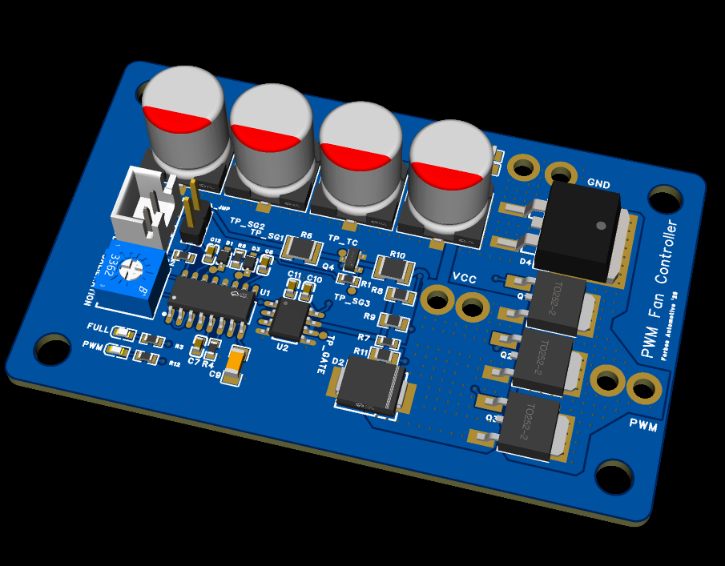
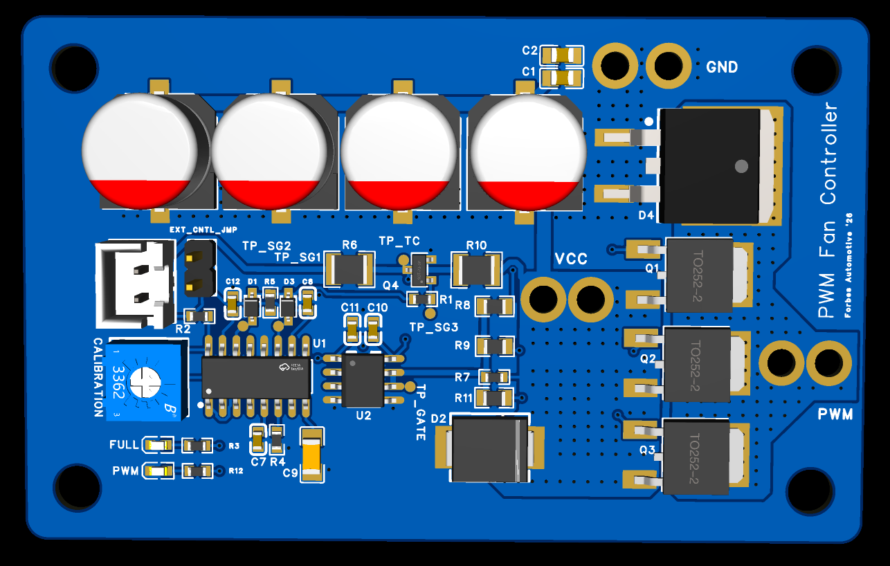

# PWM Fan Controller

High-side PWM fan controller for 12V automotive use (designed for the **MK4 Golf** radiator fan failures). Designed to replace the OEM series-resistor "low speed" with a soft-start feature, speed-adjustable ~30 kHz PWM drive — or can run in standalone with simple ground-to-activate trigger inputs.

The PCB is built around an **SG3525A** PWM controller, a **TC4420** 6 A gate driver and **3× paralleled 30 V P-channel MOSFETs** (high-side switching, no charge pump needed for 100% duty).





---

## Quick specification

| Parameter | Value |
|---|---|
| Supply (VCC) | 12V automotive (≈9–16 V; TVS clamps at 16 V stand-off) |
| Switch topology | High-side, 3× 120P03 P-channel (30 V, 3.1 mΩ, TO-252) in parallel |
| PWM frequency | **≈30 kHz** |
| Duty range | 0 – ~96 % via onboard pot (100 % via FULLSPEED trigger) |
| Soft-start | **≈5 s ramp** to set speed |
| Gate driver | TC4420 (6A peak) |
| Flyback | MBR60100DC dual Schottky (100 V / 60 A) across the fan output |
| Bulk capacitance | 4× 680 µF 35 V polymer |
| Transient protection | SMCJ16A TVS across the supply |

---

## Connections

### Power Pads

| Pad | Function |
|---|---|
| **VCC** | Supply input. Jumper fitted: the OEM "low speed" request feed. Jumper removed: permanent battery |
| **PWM** | Switched high-side output to the fan (+). Fan negative goes to vehicle ground |
| **GND** | Ground |

> No fuse or reverse-battery protection is fitted on board — always feed VCC through an appropriately rated fuse.

### EXT_CNTL — 2-pin JST-XH

External Control

| Pin | Net | Action when grounded |
|---|---|---|
| 1 | SHUTDOWN | **Enables PWM output** (releases the SG3525 from shutdown) |
| 2 | FULLSPEED | **Forces 100 % — full speed** (drives the gate stage directly, bypassing the SG3525) |

Both inputs are *active when grounded* — connect them to chassis ground via a switch or an ECU low-side output. 

---

## Operating Modes

### Jumper FITTED — OEM control

VCC is wired to the vehicle's switched "low speed" fan trigger. Because SHUTDOWN is grounded via. the jumper, the board runs whenever:

1. OEM applies 12 V "low speed" power → board powers up.
2. The SG3525 soft-starts and ramps the fan up over ~5 s.
3. The fan runs at the speed set by the **CALIBRATION** pot, PWM at ~30 kHz.

The OEM "high speed" relay path remains untouched (it drives the fan directly).

### Jumper REMOVED — standalone / ECU triggers

VCC is wired to permanent battery. The board sits idle (SHUTDOWN is pulled up to the internal 5.1 V rail → SG3525 held in shutdown, MOSFETs off) until a trigger pin on the JST connector is grounded:

| EXT_CNTL pin grounded | Result |
|---|---|
| None | Fan off |
| Pin 1 (SHUTDOWN) | PWM output at the pot-set speed, with soft-start |
| Pin 2 (FULLSPEED) | Fan hard-on at 100 % duty (no soft-start) |
| Both | Full speed (both act on the same gate-driver input) |

---

## Speed Calibration

The onboard **3362P 10 kΩ potentiometer** sits across the internal 5.1 V reference. Its wiper feeds the SG3525, setting the PWM duty cycle from 0 to ~96 %. Set it once on the bench or in the car — speed then remains fixed for every OEM/PWM activation.

## Soft-start & Switching Frequency

- **Oscillator:** RT = 10 kΩ (R4), CT = 4.7 nF (C7), discharge pin is strapped to CT → `f ≈ 1/(0.7 × 10 kΩ × 4.7 nF) ≈ 30 kHz`. The two SG3525 outputs (each f/2) are diode-OR'd (D1/D3), recombining to form a single ~30 kHz PWM signal - designed to be above audible hearing.
- **Soft-start:** C9 = 100 µF on the SG3525 SS pin, charged by the internal ~50 µA source (≈0.5 V/s). Duty ramps from 0 to the pot setting over roughly **5 seconds**, eliminating inrush through the fan and the OEM wiring. The SS capacitor is discharged whenever the board is in shutdown, so every start is soft. The FULLSPEED trigger intentionally bypasses this.

## Indicators & Test Points

| LED | Colour | Meaning |
|---|---|---|
| **FULL** | Red | VCC present (OEM slow-speed active / battery feed live) |
| **PWM** | Green | Fan output active — brightness follows duty cycle |

| Test point | Signal |
|---|---|
| TP_SG1 | SG3525 output A (f/2) |
| TP_SG2 | SG3525 output B (f/2) |
| TP_SG3 | Combined PWM after diode-OR (drives the level shifter) |
| TP_TC | TC4420 gate-driver input (inverted, 0 V = fan on) |
| TP_GATE | MOSFET gate node (rail = off, 0 V = on) |

## How it works

```
VCC ──┬─ SMCJ16A TVS, 4×680 µF bulk
      │
      ├─ SG3525A (U1): 30 kHz oscillator, error amp ← CALIBRATION pot (5.1 V VREF)
      │    OUTA ─ D3 ┐                             soft-start: 100 µF
      │    OUTB ─ D1 ┴─→ Q4 (2N7002 level shift, inverts)
      │                        │
      ├─ R10 1k pull-up ───────┤◄── FULLSPEED trigger (via R6, 0 Ω)
      │                        ▼
      ├─ TC4420 (U2) ──→ GATE ──[10 Ω × 3]──→ Q1–Q3 (P-ch, high side)
      ├─ R7 10k gate pull-up (fail-safe OFF)         │
      │                                              ▼
      └──────────────────────── fan + ◄── PWM pad ───┴── MBR60100DC flyback → GND
```

The TC4420 is non-inverting: when the SG3525 output goes high, Q4 pulls the driver input low, the driver pulls the gates to 0 V (V_GS ≈ −12 V) and the P-FETs conduct. With no drive, R7/R10 hold everything at the rail — **fan off is the default state under any fault**.

## Protection Summary

| Feature | Implementation |
|---|---|
| Supply transients | SMCJ16A TVS (16 V stand-off, 26 V clamp) |
| Flyback / freewheel | MBR60100DC dual Schottky, output → GND |
| Gate fail-safe | 10 kΩ pull-up to rail — FETs off if drive is lost |
| Inrush / mechanical stress | ~5 s soft-start ramp |
| Overcurrent / reverse battery | **Not on board** — external fuse required |
| Trigger inputs | Protection recommended before connecting to an ECU |

## Documentation

| File | Description |
|---|---|
| [hardware/PWMFanController.epro](hardware/PWMFanController.epro) | EasyEDA Pro project (schematic + PCB) |
| [docs/control-logic.md](docs/control-logic.md) | Full control logic |
| [docs/DESIGN_NOTES.md](docs/DESIGN_NOTES.md) | Design, component calculations, thermals and proposals: trigger-input protection & direct ECU PWM input |

## ⚠ Disclaimer

Verify fan stall current, fuse rating, thermals at full load and transient behaviour in your own installation before relying on it.
